# RDD-based programming

## Spark context

```java
// Create a configuration object, and set the name of the application
SparkConf conf = new SparkConf().setAppName("SparkApp");
// Create a Spark Context object
JavaSparkContext sc = new JavaSparkContext(conf);
```

## RDD basics

- A Spark RDD is an immutable distributed collection of objects
- Each RDD is split in partitions, Code is executed on each partition in isolation

### RDD: create and save

#### Create

1. Create RDDs from files

```java
// Build an RDD of Strings from the input textual file
// The number of partitions is manually set to 5
// Each element of the RDD is a line of the input file
JavaRDD<String> lines = sc.textFile(inputFile, 5);
// The data is lazily read from the input file only when the data is needed (i.e., when an action is applied on the lines RDD, or on one of its “descendant” RDDs)
```

2. Create RDDs from a local Java collection

```java
// Create a local Java list
List<String> inputList = Arrays.asList("First element", "Second element", "Third element");
// Build an RDD of Strings from the local list.
// The number of partitions is set automatically by Spark or set by the 2nd parameter
// There is one element of the RDD for each element of the local list
JavaRDD<String> distList = sc.parallelize(inputList, 3);
//  No computation occurs when sc.parallelize() is invoked
```

#### Save RDDs

1. Save in a textual(HDFS) file

```java
// Store the lines RDD in the output textual file
// Each element of the RDD is stored in a line of the output file
lines.saveAsTextFile(outputPath);
//  The content of lines is computed when saveAsTextFile() is invoked
```

2. Store in local Java variables

> Pay attention to the size of the RDD

```java
// Retrieve the content of the lines RDD and store it in a local Java collection
// The local Java collection contains a copy of each element of the RDD
List<String> contentOfLines = lines.collect();

```

### Transformations and Actions

#### Transformations

- operations on RDDs that return a new RDD
- computed lazily

#### Actions

- Return results to the Driver program
- Or write the result in the storage (output file/folder)

#### Passing functions to Transformations and Actions

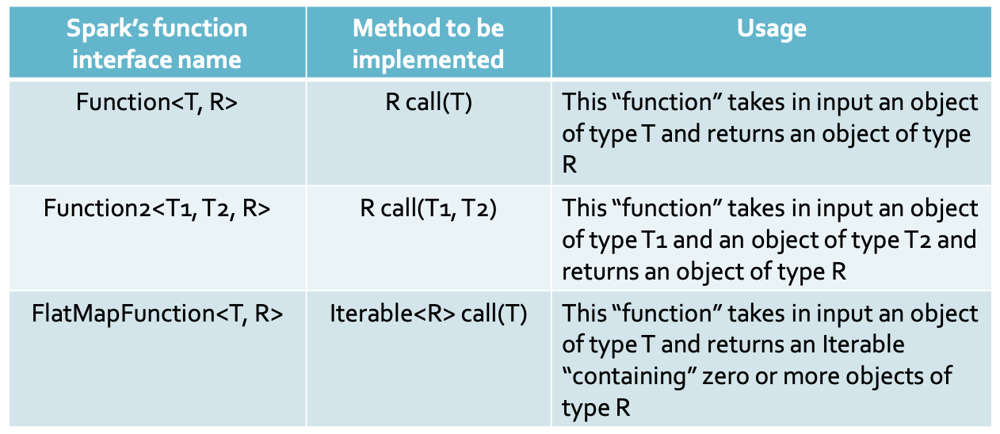

1. Solution based on named classes

```java
// Define a class implementing the Function interface
class ContainsError implements Function<String, Boolean> {
    // Implement the call method
    public Boolean call(String x) {
        return x.contains("error");
    }
}
// Select the rows containing the word “error”
JavaRDD<String> errorsRDD = inputRDD.filter(new ContainsError());
```

2. Solution based on anonymous classes

```java
// Select the rows containing the word “error”
JavaRDD<String> errorsRDD = inputRDD.filter(
    new Function<String, Boolean>() {
        public Boolean call(String x) {
            return x.contains("error");
        }
} );
```

3. Solution based on lambda functions

```java
// Select the rows containing the word “error”
JavaRDD<String> errorsRDD = inputRDD.filter(x -> x.contains("error"));
```

### Basic Transformations

#### Filter transformation

```java
List<Integer> inputList = Arrays.asList(1, 2, 3, 4);
JavaRDD<Integer> inputRDD = sc.parallelize(inputList);
JavaRDD<Integer> resRDD = inputRDD.filter(n -> n > 2);
```

#### Map transformation

```java
JavaRDD<String> inputRDD = sc.textFile('username.txt');
JavaRDD<Integer> lenRDD = inputRDD.map(e -> new Integer(e.length));
```

#### FlatMap transformation

- Duplicates are not removed
- `public Iterable<R> call(T element)` mehtod of the `FlatMapFunction<T, R>` interface must be implemented

```java
JavaRDD<String> inputRDD = sc.textFile("document.txt");
JavaRDD<String> listOfWordsRDD = inputRDD.flatMap(x -> Arrays.asList(x.split(" ")).iterator());
```

#### Distinct transformation

- A shuffle operation is executed for computing the
  result of the distinct transformation
- The shuffle operation is used to repartition the input data

```java
JavaRDD<String> inputRDD = sc.textFile("names.txt");
JavaRDD<String> distinctNamesRDD = inputRDD.distinct();
```

#### Sample transformation

- withReplacement 参数用于指定是否允许重复抽样。
  - 如果 withReplacement 为 true，则每个元素都有可能被抽中多次；
  - 如果 withReplacement 为 false，则每个元素只能被抽中一次。
- fraction 参数用于指定抽样比例。
  - 如果 fraction 为 0，则表示不进行抽样，返回原始 RDD。
  - 如果 fraction 为 1，则表示返回整个 RDD。
  - 如果 fraction 介于 0 和 1 之间，则表示返回 RDD 的 fraction 比例的元素。

```java
JavaRDD<String> inputRDD = sc.textFile("sentences.txt");
JavaRDD<String> randomSentencesRDD = inputRDD.sample(false,0.2);
```

#### Set Transformations

1. Union

- **Duplicates elements** are not removed

  `JavaRDD<T> union(JavaRDD<T> secondInputRDD)`

2. Intersection

- A **shuffle** operation is executed for computing the result of intersection

  `JavaRDD<T> intersection(JavaRDD<T> secondInputRDD)`

3. Subtract

- Duplicates are not removed
  A **shuffle** operation is executed for computing the result of **subtract**

  `JavaRDD<T> subtract(JavaRDD<T> secondInputRDD)`

4. Cartesian

- A large amount of data is sent on the network
- Elements from different input partitions must be combined to compute the returned pairs

  `JavaPairRDD<T, R> cartesian(JavaRDD<R> secondInputRDD)`

5. Examples

```java
    // Create two RDD of integers.
		List<Integer> inputList1 = Arrays.asList(1, 2, 2, 3, 3);
		JavaRDD<Integer> inputRDD1 = sc.parallelize(inputList1);
		List<Integer> inputList2 = Arrays.asList(3, 4, 5);
		JavaRDD<Integer> inputRDD2 = sc.parallelize(inputList2);

		// Create three new RDDs by using union, intersection, and subtract
		JavaRDD<Integer> outputUnionRDD = inputRDD1.union(inputRDD2);
		JavaRDD<Integer> outputIntersectionRDD = inputRDD1.intersection(inputRDD2);
		JavaRDD<Integer> outputSubtractRDD = inputRDD1.subtract(inputRDD2);

		// Create an RDD of Integers and an RDD of Strings
		List<Integer> inputList3 = Arrays.asList(1, 2, 3);
		JavaRDD<Integer> inputRDD3 = sc.parallelize(inputList3);
		List<String> inputList4 = Arrays.asList("A", "B");
		JavaRDD<String> inputRDD4 = sc.parallelize(inputList4);
		// Compute the cartesian product
		JavaPairRDD<Integer,String> outputCartesianRDD = inputRDD3.cartesian(inputRDD4);

    /**
      (1,A)
      (1,B)
      (2,A)
      (2,B)
      (3,A)
      (3,B)
     */
```

#### Summary

inputRDD1 = {1, 2, 3, 3}

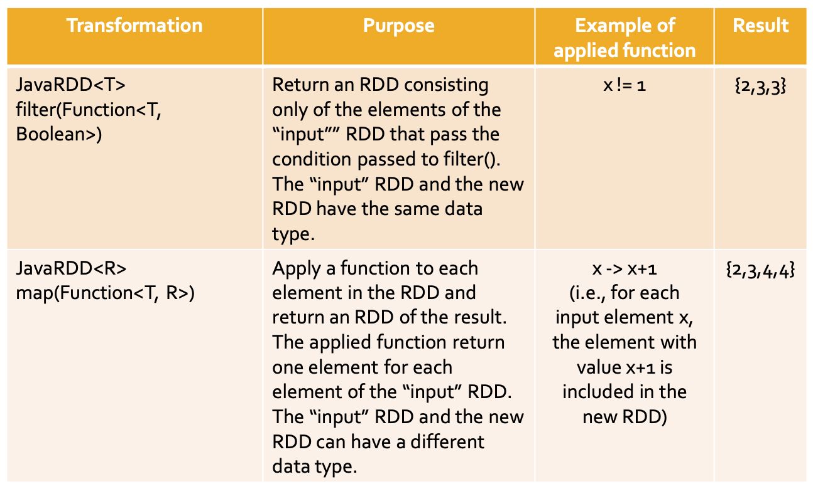

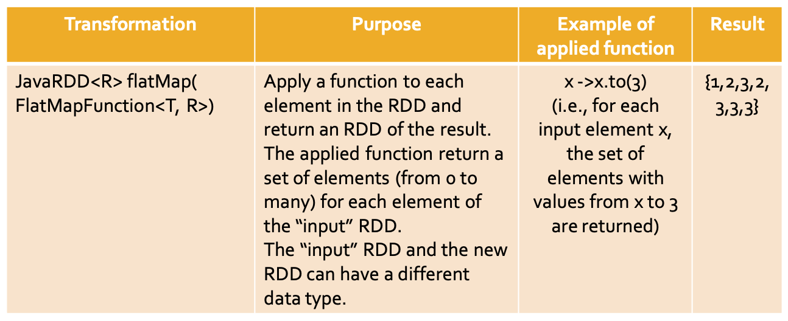

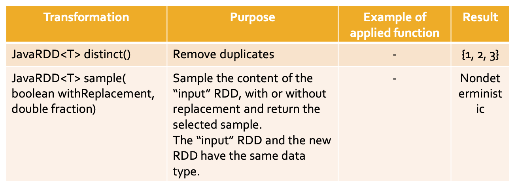

inputRDD1 = {1, 2, 2, 3, 3}
inputRDD2 = {3, 4, 5}

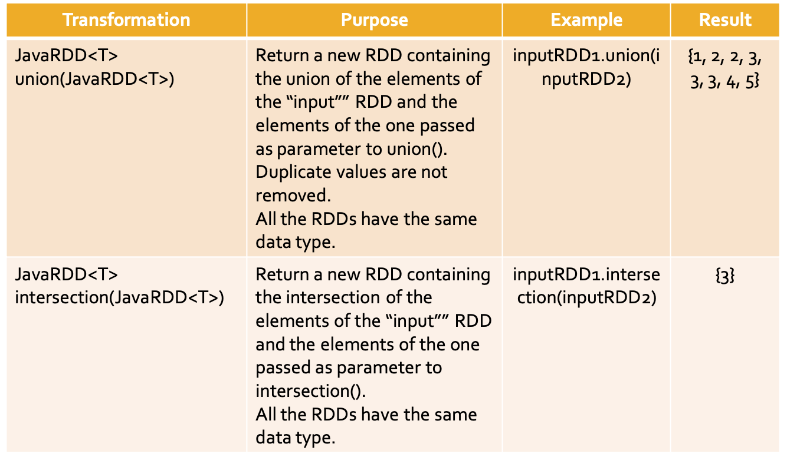

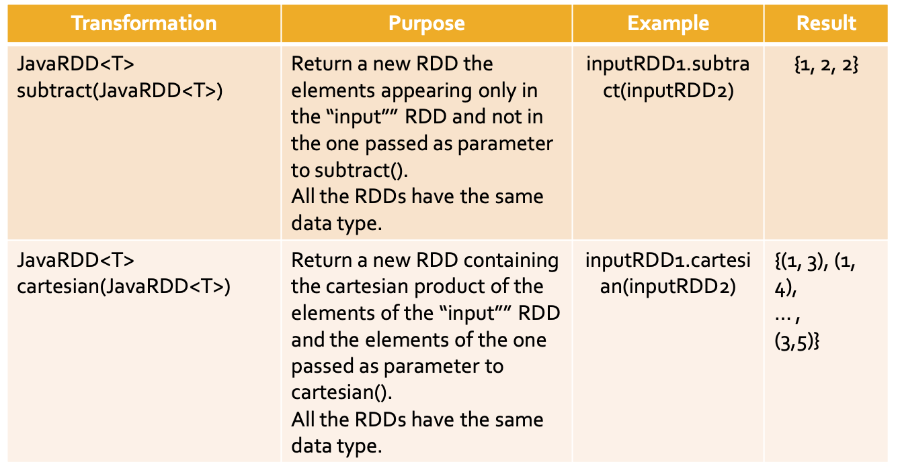

### Basic Actions

Spark actions can retrieve the content of an RDD or the result of a function applied on an RDD and

- “Store” it in a local Java variable of the Driver program
  - Pay attention to the size of the returned value
  - Pay attentions that date are sent on the network from the nodes containing the content of RDDs and the executor running the Driver
- Or store the content of an RDD in an output folder or database

1. Are executed locally on each node containing partitions of the RDD on which the action is invoked
   Local results are generated in each node
2. Local results are sent on the network to the Driver that computes the final result and store it in local variables of the Driver

#### Collect action

The collect action returns a local Java list of objects containing the same objects of the considered RDD

```java
// Create an RDD of integers. Load the values 1, 2, 3, 3 in this RDD
List<Integer> inputList = Arrays.asList(1, 2, 3, 3);
JavaRDD<Integer> inputRDD = sc.parallelize(inputList);
// Retrieve the elements of the inputRDD and store them in // a local Java list
List<Integer> retrievedValues = inputRDD.collect();
```

#### Count action

Count the number of elements of an RDD

```java
// Read the content of the two input textual files
JavaRDD<String> inputRDD1 = sc.textFile("document1.txt");
long numLinesDoc1 = inputRDD1.count();
```

#### CountByValue action

The countByValue action returns a local Java Map object containing the information about the number of times each element occurs in the RDD

```java
  List<String> inputList = Arrays.asList("a", "b", "c", "b", "c", "c");
		JavaRDD<String> inputRdd = sc.parallelize(inputList);
		java.util.Map<String, java.lang.Long> namesOccurrences = inputRdd.countByValue();
		System.out.println(namesOccurrences.toString());
    // {a=1, b=2, c=3}
```

#### Take action

The take(n) action returns a local Java list of objects containing the first n elements of the considered RDD

```java
    List<Integer> inputList = Arrays.asList(1, 5, 3, 3, 2);
		JavaRDD<Integer> inputRDD = sc.parallelize(inputList);
		List<Integer> retrievedValues = inputRDD.take(1);
    // {1}
```

#### First action

The first() action returns a local Java object containing the first element of the considered RDD

```java
    List<Integer> inputList = Arrays.asList(1, 5, 3, 3, 2);
		JavaRDD<Integer> inputRDD = sc.parallelize(inputList);
		List<Integer> retrievedValues = inputRDD.first();
    // 1
```

#### Top action

The top(n) action returns a local Java list of objects containing the top n (largest) elements of the considered RDD

```java
    List<Integer> inputList = Arrays.asList(1, 5, 3, 3, 2);
		JavaRDD<Integer> inputRDD = sc.parallelize(inputList);
		List<Integer> retrievedValues = inputRDD.top(3);
    // [5, 3, 3]
```

#### TakeOrderd action

The takeOrdered(n, comparator<T>) action returns a local Java list of objects containing the top n (smallest) elements of the considered RDD

#### TakeSample action

The takeSample(withReplacement, n, [seed]) action returns a local Java list of objects containing n random elements of the considered RDD

```java
    List<Integer> inputList = Arrays.asList(1, 5, 3, 3, 2);
		JavaRDD<Integer> inputRDD = sc.parallelize(inputList);
		List<Integer> retrievedValues = inputRDD.takeSample(false, 2);
		System.out.println(retrievedValues);
```

#### Reduce action

Return a single Java object obtained by combining the objects of the RDD by using a user provide “function”

```java
		List<Integer> inputList = Arrays.asList(1, 5, 3, 3, 2);
		JavaRDD<Integer> inputRDD = sc.parallelize(inputList);
		Integer sum = inputRDD.reduce((n1, n2) -> n1 + n2);
		System.out.println(sum);
    // 14
    Integer maxNum = inputRDD.reduce((n1, n2) -> n1 > n2 ? n1 : n2);
		System.out.println(maxNum);
```

#### Fold action

Return a single Java object obtained by combining the objects of the RDD by using a user provide “function”

Fold can be used to parallelize functions that are associative but non-commutative

E.g., concatenation of a list of strings

```java
		List<String> inputList = Arrays.asList("a", "b", "c");
		JavaRDD<String> inputRDD = sc.parallelize(inputList);
		String s = inputRDD.fold("", (s1, s2) -> s1 + s2);
		System.out.println(s);
    // abc
```

#### Aggregate action

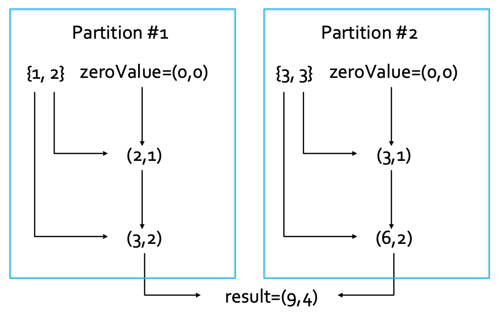

```java
class SumCount implements Serializable {
	public int sum;
	public int numElements;

	public SumCount(int sum, int numElements) {
		this.sum = sum;
		this.numElements = numElements;
	}

	public double avg() {
		return sum/(double)numElements;
	}
}

// ......

    List<Integer> inputListAggr = Arrays.asList(1, 2, 3, 3);
		JavaRDD<Integer> inputRDDAggr = sc.parallelize(inputListAggr);

		SumCount zeroValue = new SumCount(0, 0);
		SumCount result = inputRDDAggr.aggregate(zeroValue,
		(a, e) -> {
			a.sum = a.sum + e;
			a.numElements++;
			return a;
		}, (a1, a2) -> {
			System.out.println("2: a2.sum = " + a2.sum +", a2.numElements = " + a2.numElements);
			a1.sum = a1.sum + a2.sum;
			a1.numElements = a1.numElements + a2.numElements;
			return a1;
		});

		Double avgNum = result.avg();
		System.out.println(avgNum);
```

#### Summary

inputRDD1 = {1, 2, 3, 3}

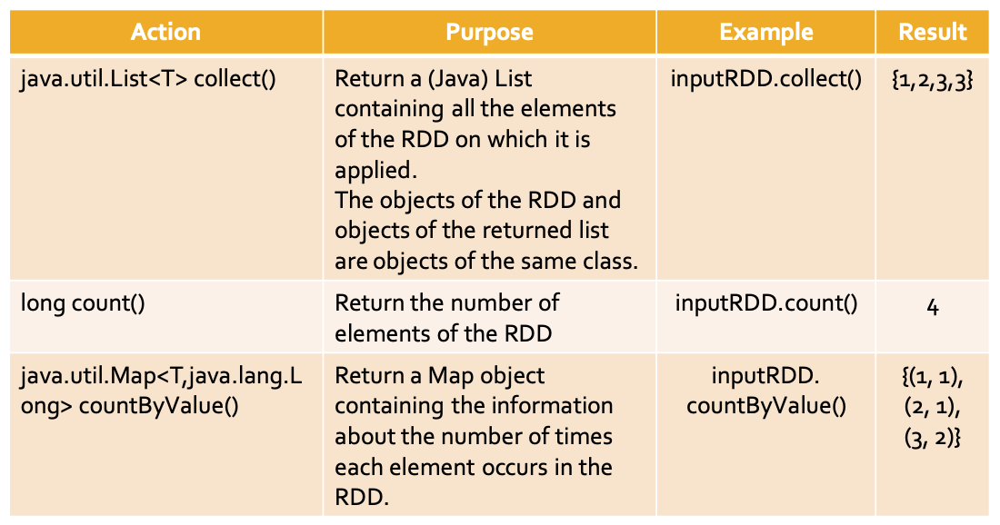

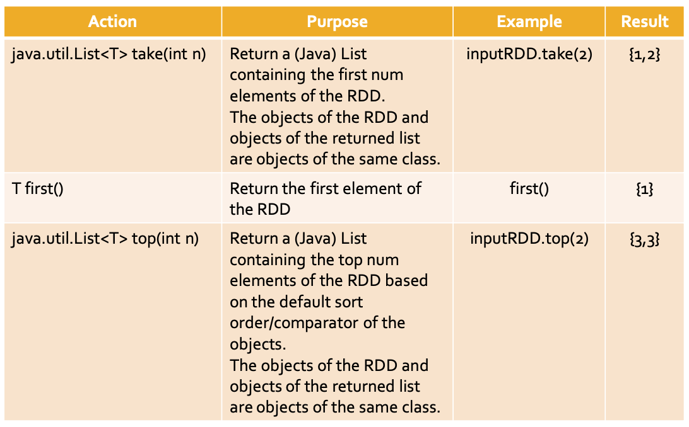

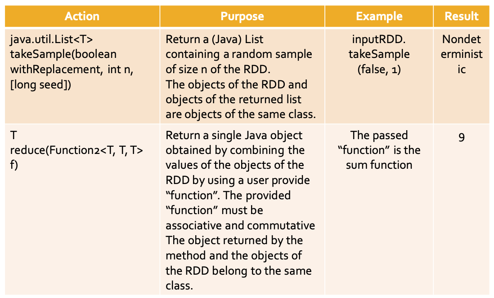

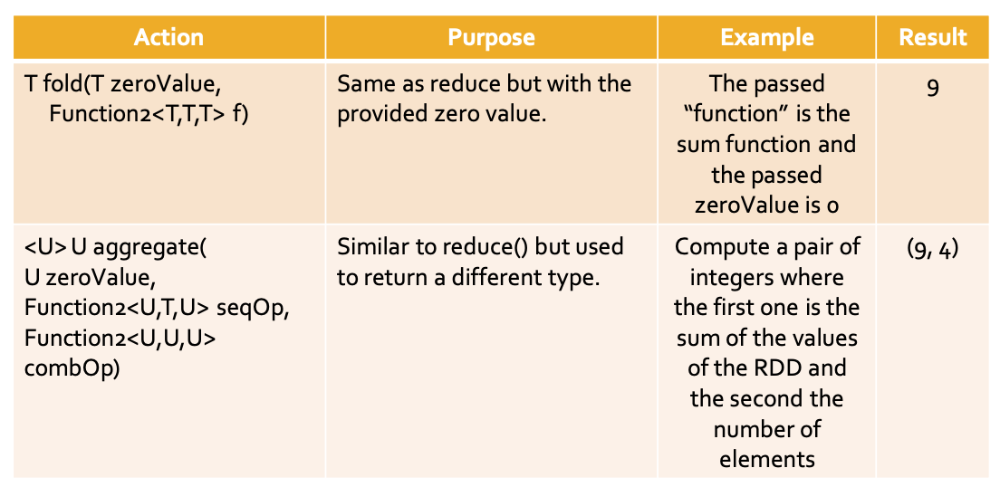
