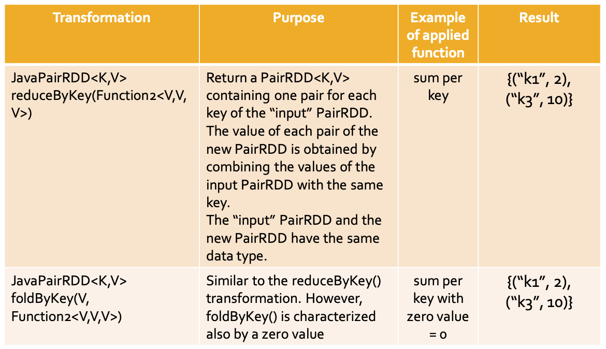
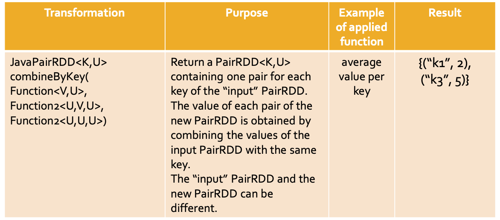
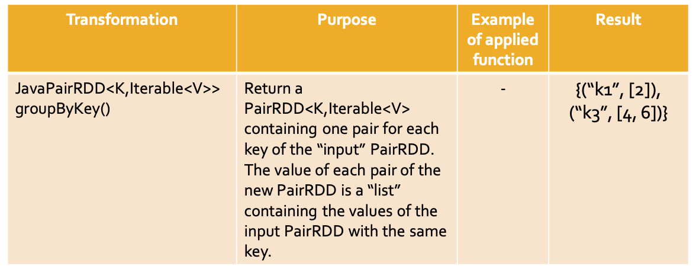
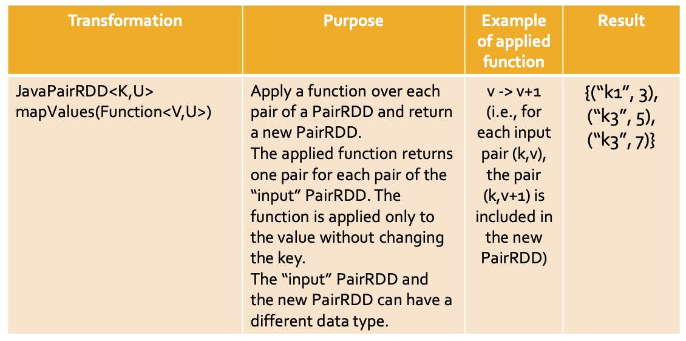
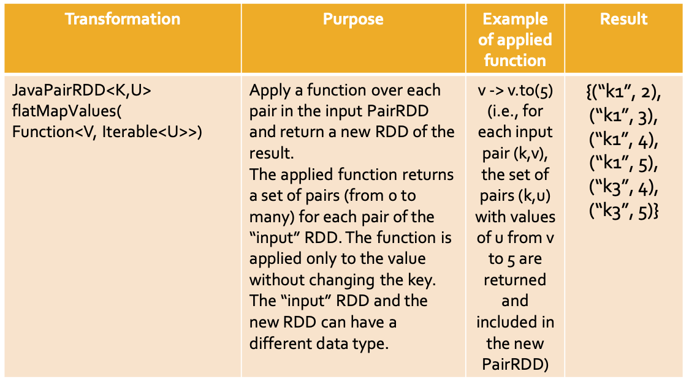
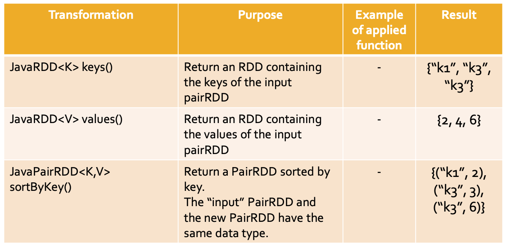
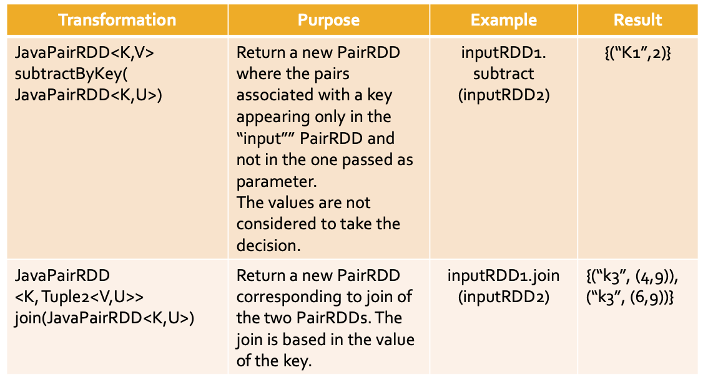
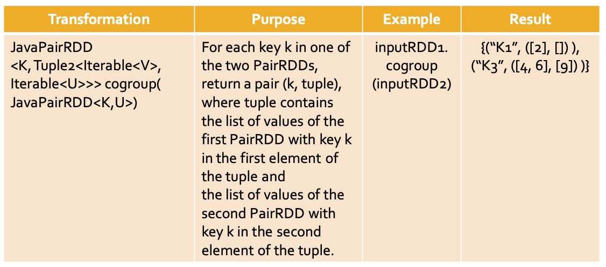
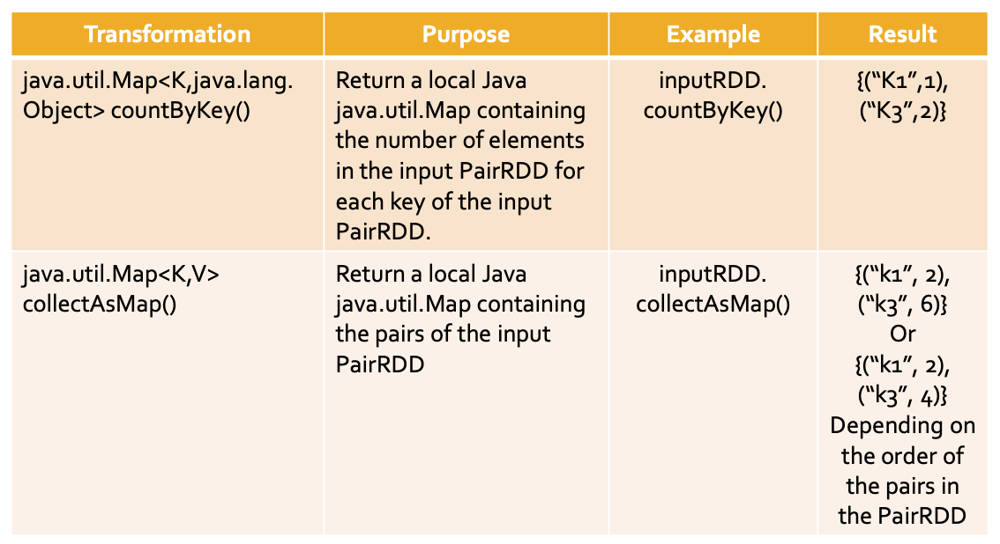
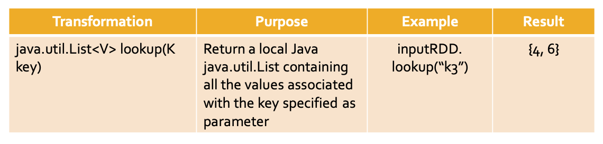

# Pair RDDs

## Creating Pair RDDs

### MapToPair transformation

```java
    // Read the content of the input textual file
    JavaRDD<String> namesRDD = sc.textFile(inputPath);
    // Create the JavaPairRDD
    JavaPairRDD<String, Integer> nameOneRDD = namesRDD.mapToPair(name -> new Tuple2<String, Integer>(name, 1));
```

### flatMapToPair transformation

```java

    JavaPairRDD<String, Integer> wordOneRDD =linesRDD.flatMapToPair(line -> {
        List<Tuple2<String, Integer>> pairs = new ArrayList<>();
        String[] words = line.split(" ");
        for (String word : words) {
            pairs.add(new Tuple2<String, Integer>(word, 1));
        }
        return pairs.iterator();
    });
```

### parallelizePairs method

```java
    ArrayList<Tuple2<String, Integer>> nameAge = new ArrayList<Tuple2<String, Integer>>();
    Tuple2<String, Integer> localPair;
    localPair = new Tuple2<String, Integer>("Paolo", 40); nameAge.add(localPair);
    localPair = new Tuple2<String, Integer>("Giorgio", 22); nameAge.add(localPair);
    localPair = new Tuple2<String, Integer>("Paolo", 35); nameAge.add(localPair);
    // Create the JavaPairRDD from the local collection
    JavaPairRDD<String, Integer> outputRdd = sc.parallelizePairs(nameAge);
```

## Transformations on Pair RDDs

### ReduceByKey

Create a new PairRDD where there is one pair for each distinct key k of the input PairRDD. The value associated with key k in the new PairRDD is computed by applying a user-provided function on the values associated with k in the input PairRDD

A shuffle operation is executed for computing the result of the reduceByKey() transformation

```java
    ArrayList<Tuple2<String, Integer>> nameAge = new ArrayList<Tuple2<String, Integer>>();
    Tuple2<String, Integer> localPair;
    localPair = new Tuple2<String, Integer>("Paolo", 40); nameAge.add(localPair);
    localPair = new Tuple2<String, Integer>("Giorgio", 22); nameAge.add(localPair);
    localPair = new Tuple2<String, Integer>("Paolo", 35); nameAge.add(localPair);
    // Create the JavaPairRDD from the local collection
    JavaPairRDD<String, Integer> namesPairRdd = sc.parallelizePairs(nameAge);

    JavaPairRDD<String, Integer> outputRdd = namesPairRdd.reduceByKey((age1, age2) -> age1 < age2 ? age1 : age2);
    /**
     * (Paolo,35)
     * (Giorgio,22)
     */
```

### FoldByKey

The foldByKey() has the same goal of the
reduceBykey() transformation. Is characterized also by a zero value.

A shuffle operation is executed for computing the result of the foldByKey() transformation.

### CombineByKey

Create a new PairRDD where there is one pair for each distinct key k of the input PairRDD. The value associated with the key k in the new PairRDD is computed by applying a user-provided function(s) on the values associated with k in the input PairRDD

A shuffle operation is executed for computing the result of the combineByKey() transformation

```java
    JavaPairRDD<String, AvgCount> avgAgePerNamePairRDD = namesPairRdd.combineByKey(
        inputElement -> new AvgCount(inputElement, 1),
        (intermediateElement, inputElement) -> {
            AvgCount combine = new AvgCount(inputElement, 1);
            combine.total = combine.total + intermediateElement.total;
            combine.numValues = combine.numValues + intermediateElement.numValues;
            return combine;
        },
        (intermediateElement1, intermediateElement2) -> {
            AvgCount combine = new AvgCount(intermediateElement1.total, intermediateElement2.total);
            combine.total = combine.total + intermediateElement2.total;
            combine.numValues = combine.numValues + intermediateElement2.numValues;
            return combine;
        }
    );
    avgAgePerNamePairRDD.saveAsTextFile(outputPath);
```

### GroupByKey

Create a new PairRDD where there is one pair for each distinct key k of the input PairRDD. The value associated with key k in the new PairRDD is the list of values associated with k in the input PairRDD

If you are grouping values per key to perform then an aggregation such as sum or average over the values of each key then groupByKey is not the right choice

groupByKey is useful if you need to apply an aggregation/compute a function that is not associative

A shuffle operation is executed for computing the result of the groupByKey() transformation

```java
	JavaPairRDD<String, Iterable<Integer>> avgAgePerNamePairRDD = namesPairRdd.groupByKey();

/**
 * (Paolo,[40, 35])
 * (Giorgio,[22])
 */
```

### MapValues

Apply a user-defined function over the value of each
pair of an input PairRDD and return a new PairRDD.

One pair is created in the returned PairRDD for each input pair

```java
JavaPairRDD<String, Integer> nameAge = namesPairRdd.mapValues(age -> new Integer(age+1));

/**
 * (Paolo,41)
 * (Giorgio,23)
 * (Paolo,36)
 */
```

### flatMapValues

Apply a user-defined function over the value of each
pair of an input PairRDD and return a new PairRDD

### Keys

Return the list of keys of the input PairRDD

- The returned RDD is not a PairRDD
- Duplicates keys are not removed

### Values

Return the list of values of the input PairRDD

- The returned RDD is not a PairRDD
- Duplicates values are not removed

### SortByKey

Return a new PairRDD obtained by sorting, in ascending order, the pairs of the input PairRDD by key
Note that the data type of the keys (i.e., K) must be a class implementing the Ordered class
A shuffle operation is executed for computing the
result of the sortByKey() transformation

### Summary

innputRDD1 = {(“k1”, 2), (“k3”, 4), (“k3”, 6)}













## Transformations on two Pair RDDs

### SubtractByKey

Create a new PairRDD containing only the pairs of the input PairRDD associated with a key that is not appearing as key in the pairs of the other PairRDD
A shuffle operation is executed for computing the
result of the subtractByKey() transformation

### Join

Join the key-value pairs of two PairRDDs based on
the value of the key of the pairs
A shuffle operation is executed for computing the
result of the join() transformation

```java
		// Create the first local Java collection
		ArrayList<Tuple2<Integer, String>> questions = new ArrayList<Tuple2<Integer, String>>();
		Tuple2<Integer, String> localPair;
		localPair = new Tuple2<Integer, String>(1, "What is .. ?"); questions.add(localPair);
		localPair = new Tuple2<Integer, String> (2, "Who is ..?"); questions.add(localPair);
		// Create the JavaPairRDD from the local collection
		JavaPairRDD<Integer, String> questionsPairRDD = sc.parallelizePairs(questions);

		// Create the second local Java collection
		ArrayList<Tuple2<Integer, String>> answers = new ArrayList<Tuple2<Integer, String>>();
		Tuple2<Integer, String> localPair2;
		localPair2 = new Tuple2<Integer, String>(1, "It is a car"); answers.add(localPair2);
		localPair2 = new Tuple2<Integer, String>(1, "It is a byke"); answers.add(localPair2);
		localPair2 = new Tuple2<Integer, String>(2, "She is Jenny"); answers.add(localPair2);
		// Create the JavaPairRDD from the local collection
		JavaPairRDD<Integer, String> answersPairRDD = sc.parallelizePairs(answers);

		// Join questions with answers
		JavaPairRDD<Integer, Tuple2<String, String>> outputRdd = questionsPairRDD.join(answersPairRDD);

        /**
         * (1,(What is .. ?,It is a car))
         * (1,(What is .. ?,It is a byke))
         * (2,(Who is ..?,She is Jenny))
         */
```

### CoGroup

Associated each key k of the input PairRDDs with

- The list of values associated with k in the input PairRDD
- And the list of values associated with k in the other PairRDD

A shuffle operation is executed for computing the result of the cogroup() transformation

```java
// Create the first local Java collection
		ArrayList<Tuple2<Integer, String>> movies = new ArrayList<Tuple2<Integer, String>>();
		Tuple2<Integer, String> localPair;
		localPair = new Tuple2<Integer, String>(1, "Star Trek"); movies.add(localPair);
		localPair = new Tuple2<Integer, String>(1, "Forrest Gump"); movies.add(localPair);
		localPair = new Tuple2<Integer, String>(2, "Forrest Gump"); movies.add(localPair);
		// Create the JavaPairRDD from the local collection
		JavaPairRDD<Integer, String> moviesPairRDD = sc.parallelizePairs(movies);

		// Create the second local Java collection
		ArrayList<Tuple2<Integer, String>> directors = new ArrayList<Tuple2<Integer, String>>();
		Tuple2<Integer, String> localPair2;
		localPair2 = new Tuple2<Integer, String>(1, "Woody Allen"); directors.add(localPair2);
		localPair2 = new Tuple2<Integer, String>(2, "Quentin Tarantino"); directors.add(localPair2);
		localPair2 = new Tuple2<Integer, String>(2, "Alfred Hitchcock"); directors.add(localPair2);
		// Create the JavaPairRDD from the local collection
		JavaPairRDD<Integer, String> directorsPairRDD = sc.parallelizePairs(directors);

		// Cogroup movies and directors per user
		JavaPairRDD<Integer, Tuple2<Iterable<String>, Iterable<String>>> outputRdd = moviesPairRDD.cogroup(directorsPairRDD);
/**
 * (1,([Star Trek, Forrest Gump],[Woody Allen]))
 * (2,([Forrest Gump],[Quentin Tarantino, Alfred Hitchcock]))
 */

```

### Summary

inputRDD1 = {(“k1”, 2), (“k3”, 4), (“k3”, 6)}
inputRDD2 = {(“k3”, 9)}





## Actions on Pair RDDs

### CountByKey

The countByKey action returns a local Java Map object containing the information about the number of elements associated with each key in the PairRDD

```java
        // Create the local Java collection
		ArrayList<Tuple2<String , Integer>> movieRating = new ArrayList<Tuple2<String, Integer>>();
		Tuple2<String, Integer> localPair;
		localPair = new Tuple2<String, Integer>("Forrest Gump", 4); movieRating.add(localPair);
		localPair = new Tuple2<String, Integer>("Star Trek", 5); movieRating.add(localPair);
		localPair = new Tuple2<String, Integer>("Forrest Gump", 3); movieRating.add(localPair);
		JavaPairRDD<String, Integer> movieRatingRDD = sc.parallelizePairs(movieRating);
		java.util.Map<String, java.lang.Long> movieNumRatings = movieRatingRDD.countByKey();
		// Print the result on the standard output
		System.out.println(movieNumRatings);
        // {Star Trek=1, Forrest Gump=2}
```

### CollectAsMap

The collectAsMap action returns a local Java java.util.Map<K,V> containing the same pairs of the considered PairRDD

A Map cannot contain duplicate

```java
        // Create the local Java collection
		ArrayList<Tuple2<String, String>> users= new ArrayList<Tuple2<String , String>>();
		Tuple2<String , String> localPair;
		localPair = new Tuple2<String , String>("User1", "Paolo"); users.add(localPair);
		localPair = new Tuple2<String , String>("User2", "Luca"); users.add(localPair);
		localPair = new Tuple2<String , String>("User3", "Daniele"); users.add(localPair);
		// Create the JavaPairRDD from the local collection
		JavaPairRDD< String, String> usersRDD = sc.parallelizePairs(users);
		// Retrieve the content of usersRDD and store it in a local Java Map
		java.util.Map<String, String> retrievedPairs = usersRDD.collectAsMap();
		// Print the result on the standard output
		System.out.println(retrievedPairs);
    /**
     * {User2=Luca, User1=Paolo, User3=Daniele}
     */
```

### Lookup

The lookup(k) action returns a local Java java.util.List<V> containing the values of the pairs of the PairRDD associated with the key k specified as parameter

```java
		// Create the local Java collection
		ArrayList<Tuple2<String , Integer>> movieRating = new ArrayList<Tuple2<String, Integer>>();
		Tuple2<String, Integer> localPair;
		localPair = new Tuple2<String, Integer>("Forrest Gump", 4); movieRating.add(localPair);
		localPair = new Tuple2<String, Integer>("Star Trek", 5); movieRating.add(localPair);
		localPair = new Tuple2<String, Integer>("Forrest Gump", 3); movieRating.add(localPair);
		JavaPairRDD<String, Integer> movieRatingRDD = sc.parallelizePairs(movieRating);
		// Select the ratings associated with “Forrest Gump”
		java.util.List<Integer> movieRatings = movieRatingRDD.lookup("Forrest Gump");
		// Print the result on the standard output
		System.out.println(movieRatings);
        // [4, 3]
```

### Summary

inputRDD1 = {(“k1”, 2), (“k3”, 4), (“k3”, 6)}




