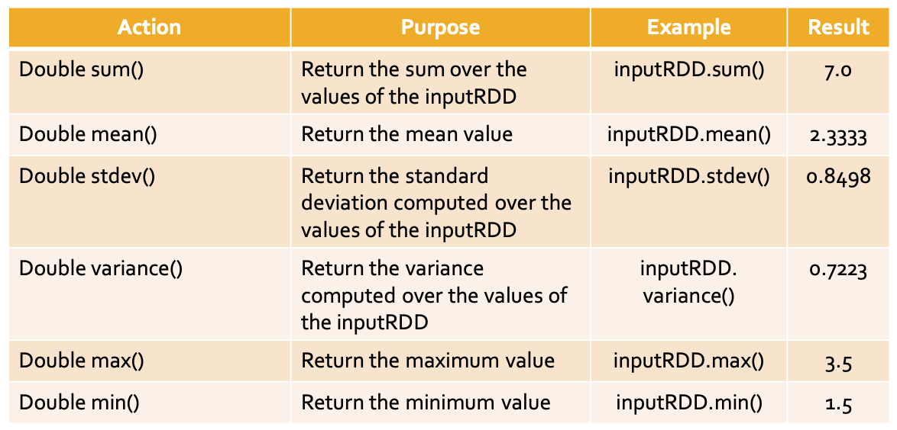

## DoubleRDDs

JavaDoubleRDD is an RDD of doubles

A generic JavaRDD<T> containing elements of type T can be transformed in a JavaDoubleRDD by using two specific transformations

- mapToDouble
- flatMapToDouble
- parallelizeDoubles

### MapToDouble transformation

```java
// Read the content of the input textual file
JavaRDD<String> surnamesRDD = sc.textFile("surnames.txt");
// Compute the lengths of the surnames
JavaDoubleRDD lenghtsDoubleRDD = surnamesRDD.mapToDouble(surname -> (double)surname.length());
```

### FlatMapToDouble transformation

```java
		// Read the content of the input textual file
		JavaRDD<String> sentencesRDD = sc.textFile(inputPath);
		// Create a JavaDoubleRDD with the lengths of words occurring in // sentencesRDD
		JavaDoubleRDD wordLenghtsDoubleRDD = sentencesRDD.flatMapToDouble(sentence -> {
			String[] words=sentence.split(" ");
			// Compute the length of each word
			ArrayList<Double> lengths=new ArrayList<Double>();
			for (String word: words) {
				lengths.add(new Double(word.length()));
			}
			return lengths.iterator();
		});
```

### DobuleRDD actions

inputDoubleRDD = {1.5, 3.5, 2.0}



```java
		List<Double> inputList = Arrays.asList(1.5, 3.5, 2.0);
		// Build a DoubleRDD from the local list
		JavaDoubleRDD distList = sc.parallelizeDoubles(inputList);
		// Compute the statistics and print them on the standard output
		System.out.println("sum: "+distList.sum());
		System.out.println("mean: "+distList.mean());
		System.out.println("stdev: "+distList.stdev());
		System.out.println("variance: "+distList.variance());
		System.out.println("max: "+distList.max());
		System.out.println("min: "+distList.min());
        /**
         * sum: 7.0
         * mean: 2.3333333333333335
         * stdev: 0.8498365855987975
         * variance: 0.7222222222222223
         * max: 3.5
         * min: 1.5
         */
```
