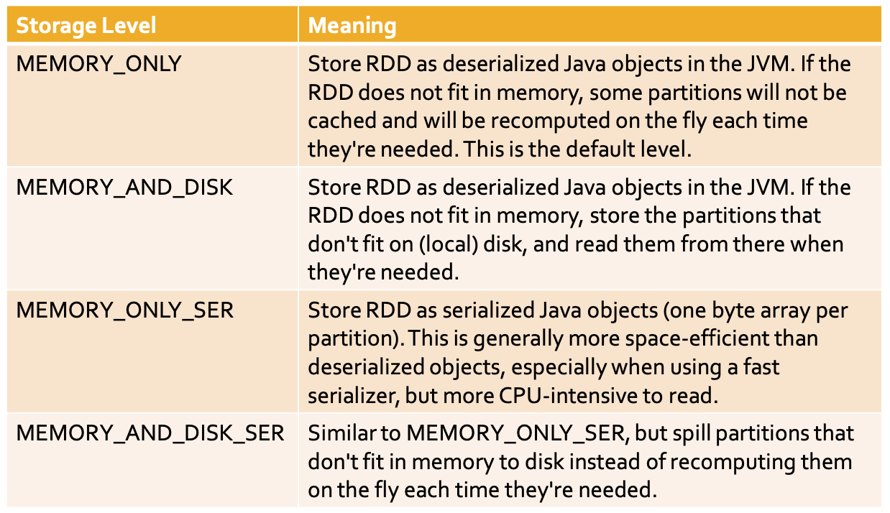
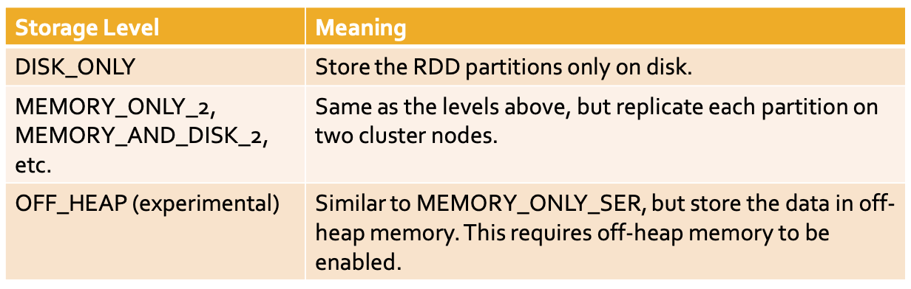

# Persistence and Cacje

## storage level

  


## method

```java
 // StorageLevel.MEMORY_ONLY()
 // StorageLevel.MEMORY_AND_DISK()
 // StorageLevel.MEMORY_ONLY_SER()
 // StorageLevel.MEMORY_AND_DISK_SER()  StorageLevel.DISK_ONLY()
 // StorageLevel.NONE()
 // StorageLevel.OFF_HEAP()


    // StorageLevel.MEMORY_ONLY_2()
    // StorageLevel.MEMORY_AND_DISK_2()
    // StorageLevel.MEMORY_ONLY_SER_2()
    // StorageLevel.MEMORY_AND_DISK_SER_2()
    // The storage level *_2() replicate each partition on two cluster nodes
    JavaRDD<T> persist(StorageLevel level)
```

```java
    JavaRDD<T> cache()
    // it is equivalent to inRDD.persist(StorageLevel.MEMORY_ONLY())
```

```java
    // remove an RDD from the cache
    JavaRDD<T> unpersist()
```

```java
        // Read the content of a textual file and cache the associated RDD
		JavaRDD<String> inputRDD = sc.textFile(inputPath).cache();
		System.out.println("Number of words: "+inputRDD.count());
		System.out.println("Number of distinct words: "+inputRDD.distinct().count());
```

# Accumulators

When a “function” passed to a Spark operation is executed on a remote cluster node, it works on separate copies of all the variables used in the function
Spark provides a type of shared variables called accumulators
Accumulators are shared variables that are only “added” to through an associative operation and can therefore be efficiently supported in parallel
They can be used to implement counters (as in MapReduce) or sums

```java

    SparkConf conf = new SparkConf().setAppName("Spark Lab #5")
            .setMaster("local");
    JavaSparkContext sc = new JavaSparkContext(conf);

    final LongAccumulator invalidEmails = sc.sc().longAccumulator();

    JavaRDD<String> emailsRDD = sc.textFile(inputPath);

    JavaRDD<String> validEmailsRDD = emailsRDD.filter((email) -> {
        boolean isValid = email.contains("@");
        if (!isValid) {
            invalidEmails.add(1);
        }
        return isValid;
    });

    System.out.println("Invalid emails before: "+invalidEmails.value());
    // Invalid emails before: 0
    validEmailsRDD.saveAsTextFile(outputPath);
    System.out.println("Invalid emails after: "+invalidEmails.value());
    // Invalid emails after: 1
    // an action (saveAsTextFile) has been executed on the validEmailsRDD and its content has been computed

```

Example with foreach

```java
    JavaRDD<String> validEmailsRDD = emailsRDD.filter((email) -> email.contains("@"));
    validEmailsRDD.saveAsTextFile(outputPath);
    emailsRDD.foreach(email -> {
        if (!email.contains("@")) invalidEmails.add(1);
    });
```

Personalized accumulator

define a new accumulator

- extending org.apache.spark.util.AccumulatorV2<T,T>

  - abstract void add(T value)
  - abstract T value()
  - abstractAccumulatorV2<T,T>copy()

- register to context

```java
    MyAcculumator myAcc = new MyAccumulator();
    sc.sc().register(myAcc, "MyNewAcc");
```

# Broadcast variables

A broadcast variable is a read-only (medium/large) shared variable

```java
        JavaRDD<String> dictRDD = sc.textFile(inputPath+"/file1.txt");
		JavaPairRDD<String, Integer> dictPairRDD = dictRDD.mapToPair(line -> {
			String[] fields = line.split(" ");
			String word = fields[0];
			Integer num = Integer.parseInt(fields[1]);
			return new Tuple2<String, Integer>(word, num);
		});

		HashMap<String, Integer> dictionary=new HashMap<String, Integer>();

		for (Tuple2<String, Integer> pair: dictPairRDD.collect()) {
			dictionary.put(pair._1(), pair._2());
		}

		final Broadcast<HashMap<String, Integer>> dictBroadcast = sc.broadcast(dictionary);

		System.out.println(dictionary);
		JavaRDD<String> fileRDD = sc.textFile(inputPath+"/file2.txt");

		JavaRDD<String> mappedFileRDD = fileRDD.map(line -> {
			String transformedString = new String("");
			String[] words = line.split(" ");
			Integer num;
			for (int i = 0; i < words.length; i++) {
				num = dictBroadcast.value().get(words[i]);
				transformedString = transformedString.concat(num+ " ");
				System.out.println(words[i] + "," + num + "," + transformedString);
			}
			return transformedString;
		});
		mappedFileRDD.saveAsTextFile(outputPath);
```
