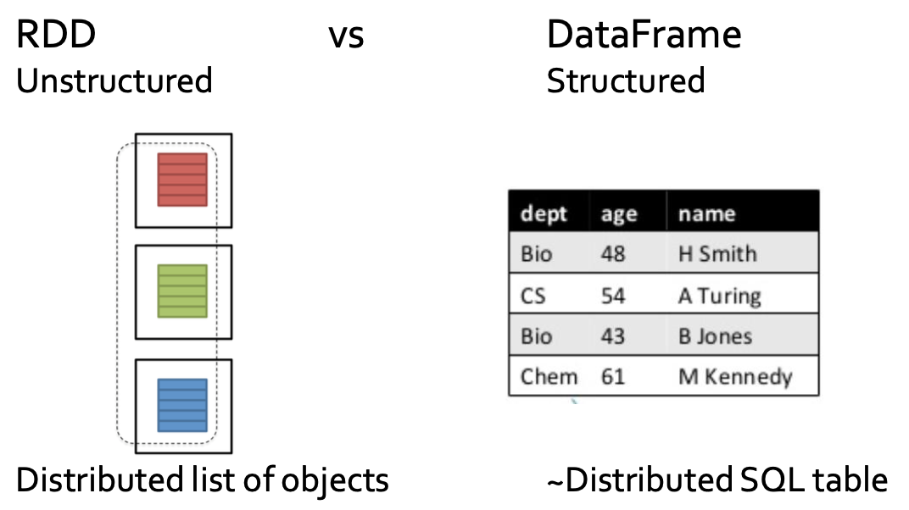

# Spark SQL

Spark SQL is the Spark component for structured data processing

It provides a programming abstraction called Dataset and can act as a distributed SQL query engine

SparkSQLusesthisextrainformationtoperform extra optimizations based on an “SQL-like” optimizer called Catalyst

    - Programs based on Datasets are usually faster than standard RDD-based programs

## Spark SQL vs Spark RDD APIs



## Datasets and DataFrames

- Dataset
  - Distributed collection of structured data
    - It provides the benefits of RDDs
      - Strong typing
      - Ability to use powerful lambda functions
    - And the benefits of Spark SQL’s optimized execution engine exploiting the information about the data structure
      - Compute the best execution plan before executing the code
- DataFrame
  - A "particular" Dataset organized into named columns
    - It is conceptually equivalent to a table in a relational database
    - It can be created reading data from different types of external sources (CSV files, JSON files, RDBMs, ..)
    - It is not characterized by the strong typing feature
  - A DataFrame is simply a Dataset of Row objects
    - i.e., DataFrame is an alias for Dataset<Row>

## Spark Session

All the Spark SQL functionalities are based on an instance of the `org.apache.spark.sql.SparkSession` class

To instance a SparkSession object use the `SparkSession.builder()` method

To “close” a Spark Session use the `SparkSession.stop()` method

```java
SparkSession ss = SparkSession.builder().appName("App.Name").getOrCreate();
// ...
ss.stop();
```

## DataFrames

### Creating DataFrames from csv files

```java
// Create a Spark Session object and set the name of the application
SparkSession ss = SparkSession.builder().appName("Test SparkSQL").getOrCreate();

// Create a DataFrame from persons.csv
DataFrameReader dfr=ss.read().format("csv").option("header", true).option("inferSchema", true);

Dataset<Row> df = dfr.load("persons.csv");
```

### Creating DataFrames from JSON files

Pay attention that reading a set of small JSON files from HDFS is very slow

```java
// Create a Spark Session object and set the name of the application
SparkSession ss = SparkSession.builder().appName("Test SparkSQL").getOrCreate();

// Create a DataFrame from persons.json
DataFrameReader dfr = ss.read().format("json");
Dataset<Row> df = dfr.load("persons.json");

// Create a DataFrame from a folder containing a set of “standard” multipline JSON files
// read multiple files are not efficient
DataFrameReader dfr = ss.read().format("json").option("multiline", true);
Dataset<Row> df = df.load("folder_JSONFiles/")

```

### Creating DataFrames from other data sources

- Apache parquet files
- External relational database, through a JDBC connection
- Hive tables
- Etc.

### From DataFrame to RDD

```java
// Create a Spark Session object and set the name of the application
SparkSession ss = SparkSession.builder().appName("Test SparkSQL").getOrCreate();
// Create a DataFrame from persons.csv
DataFrameReader dfr=ss.read().format("csv").option("header", true).option("inferSchema", true);
Dataset<Row> df = dfr.load("persons.csv");
// Define an JavaRDD based on the content of the DataFrame
JavaRDD<Row> rddPersons = df.javaRDD();
// Use the map transformation to extract the name field/column
JavaRDD<String> rddNames = rddPersons.map(inRow -> (String)inRow.getAs("name"));
// version based on getString();
JavaRDD<String> rddNames = rddPersons.map(inRow -> inRow.getString(inRow.fieldIndex("name")));

// Store the result
rddNames.saveAsTextFile(outputPath);
```

## Datasets

Datasets are more general than DataFrames
Datasets are more efficient than RDDs

### Creating Datasets from local collections

```java
public class Person implements Serializable {
    private String name;
    private int age;

    public String getName() {
        return name;
    }
    public void setName(String name) {
        this.name = name;
    }
    public int getAge() {
        return age;
    }
    public void setAge(int age) {
        this.age = age;
    }
}

// ...

// Create a Spark Session object and set the name of the application
SparkSession ss = SparkSession.builder().appName("Test SparkSQL").getOrCreate();

// Create a local array of Persons
ArrayList<Person> persons =new ArrayList<Person>();
Person person;
person = new Person(); person.setName("Paolo"); person.setAge(40); persons.add(person);
person = new Person(); person.setName("Giovanni"); person.setAge(30); persons.add(person);
person = new Person(); person.setName("Luca"); person.setAge(32); persons.add(person);

// Define the encoder that is used to serialize Person objects
Encoder<Person> personEncoder = Encoders.bean(Person.class);

// Define the Dataset based on the content of the local list of persons
Dataset<Person> personDS = ss.createDataset(persons, personEncoder);

```

#### Default encoders

- Encoder<Integer> Encoders.INT()
- Encoder<String> Encoders.STRING()

```java
// Create a Spark Session object and set the name of the application
SparkSession ss = SparkSession.builder().appName("Test SparkSQL").getOrCreate();
// Create a local list of integers
List<Integer> values = Arrays.asList(40, 30, 32);
// Encoders for most common types are provided in class Encoders
Dataset<Integer> primitiveDS = ss.createDataset(values, Encoders.INT());
```

### Creating Datasets from DataFrames

### Creating Datasets from CSV or JSON files

```java
public class Person implements Serializable {
    private String name;
    private int age;

    public String getName() {
        return name;
    }
    public void setName(String name) {
        this.name = name;
    }
    public int getAge() {
        return age;
    }
    public void setAge(int age) {
        this.age = age;
    }
}

// ...
// Create a Spark Session object and set the name of the application
SparkSession ss = SparkSession.builder().appName("Test SparkSQL").getOrCreate();

// Read the content of the input file and store it into a DataFrame
DataFrameReader dfr=ss.read().format("csv").option("header",
true).option("inferSchema", true);
Dataset<Row> df = dfr.load("persons.csv");

// Define the encoder that is used to serialize Person objects
Encoder<Person> personEncoder = Encoders.bean(Person.class);
// Define a Dataset of Person objects from the df DataFrame
Dataset<Person> ds = df.as(personEncoder);
```

### Creating Datasets for RDDs

Pay attention that the first parameter is **a scala RDD** and not **a JavaRDD**

Use `JavaRDD.toRDD(inJavaRDD)` to convert a JavaRDD into a scala RDD

## Operations on Datasets and DataFrames

### Show

The `void show(int numRows)` method of the Dataset class prints on the standard output the first numRows of the input Dataset
The `void show()` method of the Dataset class prints on the standard output all the rows of the input Dataset

```java
    // Create a Spark Session object and set the name of the application
    SparkSession ss = SparkSession.builder().appName("Test SparkSQL").getOrCreate();
    // Define the encoder that is used to serialize Person objects
    Encoder<Person> personEncoder = Encoders.bean(Person.class);
    // Read the content of the input file and store it in a Dataset<Person> dataset
    DataFrameReader dfr=ss.read().format("csv").option("header", true).option("inferSchema", true);
    Dataset<Person> ds = dfr.load("persons.csv").as(personEncoder);
    // Print, on the standard output, 2 rows of the DataFrame
    ds.show(2);
/**
 *  +-------+----+
    |   Name| Age|
    +-------+----+
    |   Andy|  30|
    |Michael|null|
    +-------+----+
  */
```

### PrintSchema

The void printSchema() method of the Dataset class prints on the standard output the schema of the Dataset

```java
    // Print, on the standard output, the schema of the DataFrame
	ds.printSchema();

    /**
     * root
        |-- Name: string (nullable = true)
        |-- Age: integer (nullable = true)
     */
```

### Count

The long count() method of the Dataset class returns the number of rows in the input Dataset

```java
// Print, on the standard output, the number of persons
System.out.println("The input file contains "+ds.count()+" persons");
```

### Distinct

The Dataset distinct() method of the Dataset class returns a new Dataset that contains only the unique rows of the input Dataset

- Pay attention that the distinct operation is always an heavy operation in terms of data sent on the network
- A shuffle phase is needed

```java
        // Create a configuration object and set the name of the application
		SparkConf conf = new SparkConf().setAppName("Spark Lab #5")
				.setMaster("local");
		JavaSparkContext sc = new JavaSparkContext(conf);
		// Create a Spark Session object and set the name of the application
		SparkSession ss = SparkSession.builder().appName("Test SparkSQL").getOrCreate();
		// Read the content of the input file and store it in a Dataset<String> // dataset
		DataFrameReader dfr = ss.read().format("csv").option("header", true).option("inferSchema", true);
		Dataset<String> ds = dfr.load("data/names.csv").as(Encoders.STRING());
		// Create a new Dataset without duplicates
		Dataset<String> distinctNames=ds.distinct();
		distinctNames.show();
        /**
         *  +-------+
            |   Name|
            +-------+
            |Michael|
            |   Andy|
            | Justin|
            +-------+
         *
        */
```

### Select

Pay attention that the select method can generate errors at runtime if there are mistakes in the names of the columns

```java
        SparkSession ss = SparkSession.builder().appName("Test SparkSQL").getOrCreate();
		// Define the encoder that is used to serialize Person objects
		Encoder<Person> personEncoder = Encoders.bean(Person.class);
		// Read the content of the input file and store it in a Dataset<Person> dataset
		DataFrameReader dfr = ss.read().format("csv")
								.option("header", true)
								.option("inferSchema", true);
		Dataset<Person> ds = dfr.load("data/persons.csv").as(personEncoder);

		// Create a new Dataset containing only name and age of the persons
		Dataset<Row> dfNamesAges = ds.select("name","age");
```

### SelectExpr

TheDataset<Row>selectExpr(String expression1, .., String expressionN) method of the Dataset class returns a new Dataset that contains a set of columns computed by combining the original columns

```java
SparkSession ss = SparkSession.builder().appName("Test SparkSQL").getOrCreate();
		// Define the encoder that is used to serialize Person objects
		Encoder<Person> personEncoder = Encoders.bean(Person.class);
		// Read the content of the input file and store it in a Dataset<Person> dataset
		DataFrameReader dfr = ss.read().format("csv")
								.option("header", true)
								.option("inferSchema", true);
		Dataset<Person> ds = dfr.load("data/persons.csv").as(personEncoder);
		// Create a new Dataset containing name, age, gender, and age+1 for each person
		Dataset<Row> df = ds.selectExpr("name", "age", "gender", "age+1 as newAge");
		df.show();
/**
 *  +-------+----+------+------+
    |   name| age|gender|newAge|
    +-------+----+------+------+
    |   Andy|  30|     M|    31|
    |Michael|null|     M|  null|
    | Justin|  19|     F|    20|
    +-------+----+------+------+
 */
```

### Map

TheDataset<U>map(scala.Function1<T,U> func, Encoder<U> encoder) method of the Dataset class returns a new Dataset
This method can be used instead of select(..) and selectExpr(..) to select a subset of the input columns or a combinations of them
The advantage is that we can identify “semantic” errors at compile time with this method

```java
    // Create a new Dataset containing name, surname and age+1 // for each person
    Dataset<PersonNewAge> ds2 = ds.map(p -> {
                                    PersonNewAge newPersonNA = new PersonNewAge();
                                    newPersonNA.setName(p.getName());
                                    newPersonNA.setAge(p.getAge());
                                    newPersonNA.setGender(p.getGender());
                                    newPersonNA.setNewAge(p.getAge()+1);
                                    System.out.println(p.getGender());
                                    return newPersonNA;
                                }
                            , Encoders.bean(PersonNewAge.class));

    ds2.show();
```

### Filter

TheDatasetfilter(StringconditionExpr) method of the Dataset class returns a new Dataset that contains only the rows satisfying the specified condition

```java
    Dataset<Person> dsFiltered = ds.filter("age >= 20 and age < 31");

    Dataset<Person> dsFiltered = ds.filter( p -> {
        if (p.getAge() >= 20 && p.getAge() < 31) {
            return true;
        }
        return false;
    });

    dsFiltered.show();
```

### Where

The Dataset where(Stringexpression) method of the Dataset class is an alias of the filter(String conditionExpr) method

### Join (inner join)

The Dataset<Row> join(Dataset<T>right, Column joinExprs) method of the Dataset class is used to join two Datasets

- Can generate errors at runtime if there are errors
  in the join expression
- Returns a DataFrame

```java
// Create a Spark Session object and set the name of the application
		SparkSession ss = SparkSession.builder().appName("Test SparkSQL").getOrCreate();
		// Define the encoder that is used to serialize PersonID objects
		Encoder<PersonID> personIDEncoder = Encoders.bean(PersonID.class);
		// Read persons_id.csv and store it in a Dataset<PersonID>
		Dataset<PersonID> dsPersons = ss.read().format("csv")
									.option("header", true)
									.option("inferSchema", true)
									.load("data/persons_id.csv")
									.as(personIDEncoder);

		dsPersons.show();

		// Define the encoder that is used to serialize UIDSport objects
		Encoder<UIDSport> uidSportEncoder = Encoders.bean(UIDSport.class);
		// Read liked_sports.csv and store it in a Dataset<UIDSport>
		Dataset<UIDSport> dsUidSports = ss.read().format("csv")
										.option("header", true)
										.option("inferSchema", true)
										.load("data/liked_sports.csv")
										.as(uidSportEncoder);

		dsUidSports.show();

		// Join the two input Datasets
		Dataset<Row> dfPersonLikes = dsPersons.join(dsUidSports,
								dsPersons.col("uid").equalTo(dsUidSports.col("uid")));
		// Print the result on the standard output
		dfPersonLikes.show();
        /**
         *  +---+----+----+---+------------+
            |uid|name| age|uid|   sportname|
            +---+----+----+---+------------+
            |  1|  aa|20.0|  1|    football|
            |  2|  bb|23.0|  2| baseketball|
            |  3|  cc|25.0|  3|    pingpong|
            +---+----+----+---+------------+
         */
```

#### Other Join Types

inner, outer, full, fullouter, leftouter, left, rightouter, right, leftsemi, leftanti, cross

leftanti is useful to implement the sutract operation

````java
// Create a Spark Session object and set the name of the application
		SparkSession ss = SparkSession.builder().appName("Test SparkSQL").getOrCreate();
		// Define the encoder that is used to serialize PersonID objects
		Encoder<PersonID> personIDEncoder = Encoders.bean(PersonID.class);
		// Read persons_id.csv and store it in a Dataset<PersonID>
		Dataset<PersonID> dsPersons = ss.read().format("csv")
									.option("header", true)
									.option("inferSchema", true)
									.load("data/persons_id.csv")
									.as(personIDEncoder);

		dsPersons.show();

		// Read banned.csv and store it in a Dataset<Banned> dataset
		Dataset<Banned> dsBanned = ss.read().format("csv")
									.option("header", true)
									.option("inferSchema", true)
									.load("data/banned.csv")
									.as(Encoders.bean(Banned.class));


		dsBanned.show();

		// Apply a left-anti join to select the records of the users
		// occurring only in dsProfiles and not in dsBanned
		Dataset<Row> nonBannedProfiles = dsPersons.join(dsBanned,
								dsPersons.col("uid").equalTo(dsBanned.col("uid")),
								"leftanti");

		// Print the result on the standard output
		nonBannedProfiles.show();
/**
 *  +---+----+----+
    |uid|name| age|
    +---+----+----+
    |  1|  aa|20.0|
    |  2|  bb|23.0|
    |  3|  cc|25.0|
    +---+----+----+

    +---+----------------+
    |Uid|BannedMotivation|
    +---+----------------+
    |  1|             abc|
    +---+----------------+

    +---+----+----+
    |uid|name| age|
    +---+----+----+
    |  2|  bb|23.0|
    |  3|  cc|25.0|
    +---+----+----+
 */
```java
````

### Aggregates functions

Aggregate functions are provided to compute aggregates over the set of values of columns

The agg(aggregate functions) method of the Dataset class is used to specify which aggregate functions we want to apply

```java
        // Create a Spark Session object and set the name of the application
		SparkSession ss = SparkSession.builder().appName("Test SparkSQL").getOrCreate();

		Dataset<Person> dsPerson = ss.read().format("csv")
									.option("header", true)
									.option("inferSchema", true)
									.load("data/persons.csv")
									.as(Encoders.bean(Person.class));

		dsPerson.show();

		// Compute the average of age
		Dataset<Row> averageAge = dsPerson.agg(org.apache.spark.sql.functions.avg("age"), org.apache.spark.sql.functions.count("*"));

		averageAge.show();

        /**
         *  +--------+--------+
            |avg(age)|count(1)|
            +--------+--------+
            |    26.0|       4|
            +--------+--------+
         */
```

### groupBy and aggregates functions

```java
		// Group data by name
		RelationalGroupedDataset rgd = dsPerson.groupBy("name");
		// Compute the average of age for each group
		Dataset<Row> nameAverageAge = rgd.avg("age");
        /**
         *  +-------+--------+
            |   name|avg(age)|
            +-------+--------+
            |Michael|    15.0|
            |   Andy|    35.0|
            | Justin|    19.0|
            +-------+--------+
         */
        // We use the aggr method to return two columns (one for each aggregate function)
		Dataset<Row> nameAvgAgeCount = rgd.agg(org.apache.spark.sql.functions.avg("age"), org.apache.spark.sql.functions.count("name"));
        /**
                +-------+--------+-----------+
                |   name|avg(age)|count(name)|
                +-------+--------+-----------+
                |Michael|    15.0|          1|
                |   Andy|    35.0|          2|
                | Justin|    19.0|          1|
                +-------+--------+-----------+
        */
```

### Sort

```java
		// Create a new Dataset with data sorted by desc. age, asc. name
		Dataset<Person> sortedAgeName = dsPerson.sort(new Column("age").desc(), new Column("name"));
		sortedAgeName.show();

        /**
         *  +-------+---+------+
            |   name|age|gender|
            +-------+---+------+
            |   Andy| 40|     M|
            | Justin| 40|     F|
            |   Andy| 30|     F|
            |Michael| 15|     M|
            +-------+---+------+
         */
```

## Dataset, DataFrames and the SQL language

```java
		// Assign the “table name” people to the ds Dataset
		dsPerson.createOrReplaceTempView("people");
		// Select the persons with age between 20 and 31
		// by querying the people table
		Dataset<Row> selectedPersons = ss.sql("SELECT * FROM people WHERE age>=20 and age<=31");
		// Print the result on the standard output
		selectedPersons.show();
        /**
         *  +----+---+------+
            |name|age|gender|
            +----+---+------+
            |Andy| 30|     F|
            +----+---+------+
         */

        // Join the two input tables by using the SQL-like syntax
		Dataset<Row> dfPersonLikes = ss.sql("SELECT * from people, sports where people.uid=sports.uid");
		// Print the result on the standard output
		dfPersonLikes.show();

        /**
         *  +---+----+----+---+------------+
            |uid|name| age|uid|   sportname|
            +---+----+----+---+------------+
            |  1|  aa|20.0|  1|    football|
            |  2|  bb|23.0|  2| baseketball|
            |  3|  cc|25.0|  3|    pingpong|
            +---+----+----+---+------------+
         */

        // Define groups based on the value of name and compute average and // number of rows for each group
		Dataset<Row> nameAvgAgeCount = ss.sql("SELECT name, avg(age), count(name) FROM people GROUP BY name");
		// Print the result on the standard output
		nameAvgAgeCount.show();

        /**
         *  +-------+--------+-----------+
            |   name|avg(age)|count(name)|
            +-------+--------+-----------+
            |Michael|    15.0|          1|
            |   Andy|    35.0|          2|
            | Justin|    40.0|          1|
            +-------+--------+-----------+
         */
```

### Dataset vs DataFrames vs SQL


### Save Datasets and DataFrames

1. Convert Datasets (and DataFrames) to traditional RDDs by using the `JavaRDD<T> javaRDD()`
2. Use the DataFrameWriter<Row> write() method of Datasets combined with format(String filetype) and void save(String outputFolder) method

```java
        // Save the file on the disk
		dsPerson.javaRDD().saveAsTextFile(outputPath);

		// Save the file on the disk by using the CSV format
		//
        dsPerson.write().format("csv").option("header", true).save(outputPath);
```

### Spark SQL: User Defined Functions

UDFs are defined/registered by invoking the `udf().register(String name, UDF function, DataType datatype)` on the JavaSparkSession

- name: name of the defined UDF
- function: lambda function/class used to specify how the parameters of the function are used to generate the
  returned value
  - One of more input parameters
  - One single returned value
- datatype: SQL data type of the returned value

```java
        // Create a Spark Session object and set the name of the application
		SparkSession ss = SparkSession.builder().appName("Test SparkSQL").getOrCreate();
		ss.udf().register("length", (String name) -> name.length(), DataTypes.IntegerType);

        // Use of thed efined UDF in a selectExpr transformation
        Dataset<Row> result = inputDF.selectExpr("length(name) as size");

        // Use of the defined UDF in a SQL query
        Dataset<Row> result = ss.sql("SELECT length(name) FROM profiles");
```
